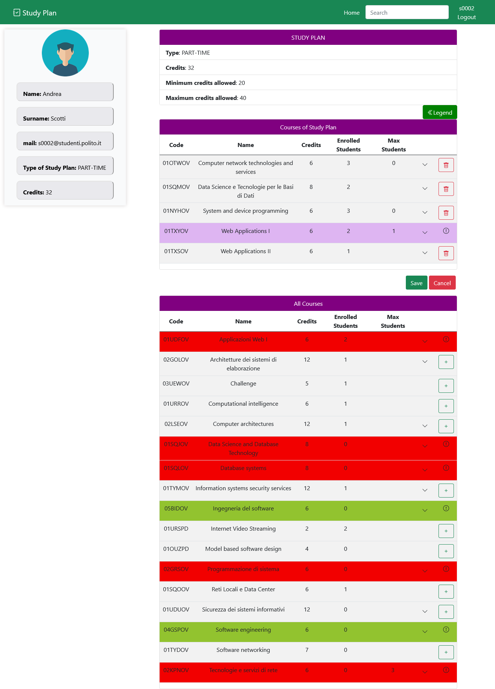
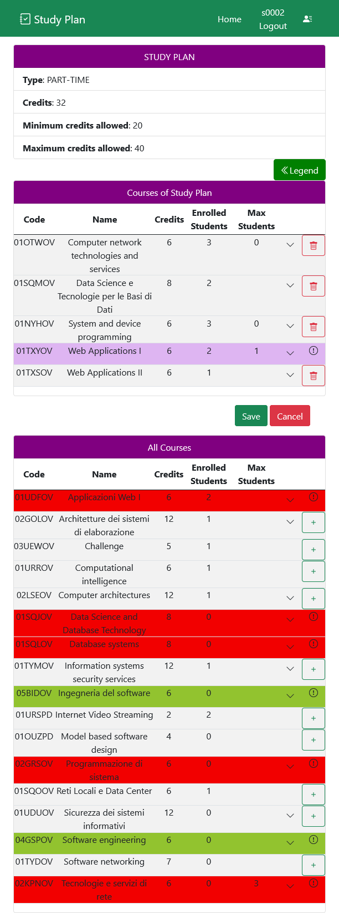

# Exam #1: "StudyPlan"
## Student: s303369 Singh Simran 

## React Client Application Routes

- Route `/`: it is the parent route and it renders the outlet component containing the navbar and the toast container in the nested routes. 
At the same URL in the parent outlet is rendered the `index route` whose content is same to the one of the `/Home` route. *See below*. 

- Route `/Home`: Home page of the app. The table shows the page content according to different cases. 

  |User logged in| User enrolled | Page content |
  | ----------- | ----------- |----------- |
  | No      |   / | All courses|
  | Yes  | No  | Form to create a new study plan and all courses. User's profile info are shown at the side |
  | Yes  | Yes | Type of study plan, courses of study plan and all courses. User's profile info are shown at the side|
- Route `/search/:code`: it displays the page containing all the courses whose code includes the parameter the user is searching for.
- Route `/Login`: it displays the login form.
- Route `/editStudyPlan`: the page allows the user to edit the list of study plan's courses according to the constrains.  It displays the study plan choosen by the user with the credits reached, the list of courses inserted in the study plan and the list of all courses that the user can choose.

## API Server
- GET `/api/courses`
  |Request body content | Request parameter | Responses |Response body content |
  | ----------- | ----------- |----------- |----------- |
  | |  | **500 Internal Server Error** error|
  | |  |**200 Success**  | a JSON object with courses  |
- GET `/api/courses/:code`
  |Request body content | Request parameter | Responses |Response body content |
  | ----------- | ----------- |----------- |----------- |
  | | **code** that the courses retrieved must contain | **500 Internal Server Error** error|
    | | **code** that the courses retrieved must contain |**404 Not Found**  | "Course not found"  |
  | | **code** that the courses retrieved must contain |**200 Success**  | a JSON object with courses whose code contains the code parameter  |

- POST `/api/sessions`
  |Request body content | Request parameter | Responses | Response body content |
  | ----------- | ----------- |----------- |----------- |
  | **id** of the student and **password** | |  **403 Forbidden**: client does not have proper authorization to access the requested content. ||
  | | | **500 Internal Server Error**||
  | | | **201 Success**||
- DELETE `/api/sessions/current`
  |Request body content | Request parameter | Responses |Response body content |
  | ----------- | ----------- |----------- |----------- |
  | | | **500 Internal Server Error**  ||
  | | | **204 No Content** success||

- GET `/api/sessions/current`
  |Request body content | Request parameter | Responses |Response body content |
  | ----------- | ----------- |----------- |----------- |
  | | | **401 Unauthorized**  | 'Not authenticated' |
  | | | **500 Internal Server Error** error||
  | | | **200 Success**  | a JSON object with user info e.g.   {id:"s0001", name: "Fabio" , surname: "Stani", mail: "s0001@studenti.polito.it", type:"PART-TIME", credits: 30}  |
- GET `/api/studyPlan/:id`
  |Request body content | Request parameter | Responses |Response body content |
  | ----------- | ----------- |----------- |----------- |
  | | **id** that corresponds to the student id | **401 Unauthorized**  | 'Not authenticated' |
  | | **id** that corresponds to the student id | **500 Internal Server Error** error|
  | | **id** that corresponds to the student id | **404 Not Found** user id not found|'Not Found'|
  | | **id** that corresponds to the student id | **422 Unprocessable** user id not valid|'Unprocessable Entity'|
  | | **id** that corresponds to the student id |**200 Success**  | a JSON object with study plan info e.g.   {type:"PART-TIME", credits: 30}  |
- PUT `/api/studyPlan/:id`
  |Request body content | Request parameter | Responses |Response body content |
  | ----------- | ----------- |----------- |----------- |
  |a JSON object with study plan info e.g.   {type:"PART-TIME", credits: 30} | **id** that corresponds to the student id | **401 Unauthorized**  | 'Not authenticated' |
  | a JSON object with study plan info e.g.   {type:"PART-TIME", credits: 30}| **id** that corresponds to the student id | **500 Internal Server Error** error|
  |a JSON object with study plan info e.g.   {type:"PART-TIME", credits: 30} | **id** that corresponds to the student id | **404 Not Found** user id not found|"Study plan associated to the user does not exist"|
  | a JSON object with study plan info e.g.   {type:"PART-TIME", credits: 30}| **id** that corresponds to the student id | **422 Unprocessable** user id not valid|'Unprocessable Entity'|
    | a JSON object with study plan info e.g.   {type:"PART-TIME"}| **id** that corresponds to the student id | **422 Unprocessable** missing parameters|'Missing parameters'|
    | a JSON object with study plan info e.g.   {type:"PART-TIME", credits: 30}| **id** that corresponds to the student id | **422 Unprocessable** credits constraints not satisfied|'Credits constraints not satisfied'|
  | a JSON object with study plan info e.g.   {type:"PART-TIME", credits: 30}| **id** that corresponds to the student id |**201 Success**  |  |

- GET `/api/studyPlan/:id/courses`
  |Request body content | Request parameter | Responses |Response body content |
  | ----------- | ----------- |----------- |----------- |
  | | **id** that corresponds to the student id | **401 Unauthorized**  | 'Not authenticated' |
  | | **id** that corresponds to the student id | **500 Internal Server Error** error|
  | | **id** that corresponds to the student id | **404 Not Found** courses associated to the user id's study plan not found|'Not Found'|
  | | **id** that corresponds to the student id | **422 Unprocessable** user id not valid|'Unprocessable Entity'|
  | | **id** that corresponds to the student id |**200 Success**  | a JSON object with courses  |

- DELETE `/api/studyPlan/:id/courses`
  |Request body content | Request parameter | Responses |Response body content |
  | ----------- | ----------- |----------- |----------- |
  |  a JSON object with courses to be deleted | **id** that corresponds to the student id | **401 Unauthorized**  | 'Not authenticated' |
   |  a JSON object with courses to be deleted | **id** that corresponds to the student id | **500 Internal Server Error** error| "StudyPlan not saved properly"|
  |  a JSON object with courses to be deleted |  **id** that corresponds to the student id | **404 Not Found** course not found in the study plan |'Course Not Found'|
  |  a JSON object with courses to be deleted | **id** that corresponds to the student id | **422 Unprocessable** user id or course property not valid|'Unprocessable Entity'|
    |  a JSON object with courses to be deleted | **id** that corresponds to the student id | **422 Unprocessable** missing parameters |'Missing parameters'|
   |  a JSON object with courses to be deleted |  **id** that corresponds to the student id |**204 No Content**  | 'success'  |

- PUT `/api/studyPlan/:id/courses`
  |Request body content | Request parameter | Responses |Response body content |
  | ----------- | ----------- |----------- |----------- |
  |  a JSON object with courses that will update the study plan | **id** that corresponds to the student id | **401 Unauthorized**  | 'Not authenticated' |
   |  a JSON object with courses that will update the study plan  | **id** that corresponds to the student id | **500 Internal Server Error** error| "StudyPlan not saved properly"|
   |  a JSON object with courses that will update the study plan   |  **id** that corresponds to the student id | **404 Not Found** course not found in the study plan |'Course Not Found'|
   |  a JSON object with courses that will update the study plan  | **id** that corresponds to the student id | **422 Unprocessable** user id or course property not valid|'Unprocessable Entity'|
  |  a JSON object with courses that will update the study plan  | **id** that corresponds to the student id | **422 Unprocessable** courses constraints not satisfied|"Course constraints not satisfied"|
   |  a JSON object with courses that will update the study plan  | **id** that corresponds to the student id | **422 Unprocessable** missing parameters |'Missing parameters'|
   |  a JSON object with courses that will update the study plan  |  **id** that corresponds to the student id |**200 Success**  | 'success'  |

## Database Tables

- Table `COURSE` - contains: `code,name,credits,studentsEnrolled,maxStudents,preparatoryCourse`  It contains all the courses
- Table `INCOMPATIBLE_COURSES` - contains: `code1,code2`  It contains codes of the courses incompatible
- Table `USERS` - contains: `id,name,surname, mail, password, salt`  It contains user's info.
- Table `STUDY_PLAN` - contains: `id,type,credits`  It contains the type of study plan choosen by the student identified by the id which corresponds to the student Id. It contains the number of credits already reached too.
- Table `COURSES_STUDY_PLAN` - contains: `id,codeCourse`  It contains courses of student's study plan . The id corresponds to the student id while codeCourse to the code of course present in the study plan.

## Main React Components

- `CourseRoute` (`CourseViews.js`): it just displays all the courses in a table.
    - The table is created by `CourseTable` (in `CourseTable.js`): used for displaying all courses and the courses of study plan too. Each row is mapped to `CourseData` (in `CourseData.js`) in order to put the information in the row of the table.
- `SearchRoute` (`CourseViews.js`): it displays all the courses that matches the parameter code in a table.
- `HomePageLoggedIn` (`CourseViews.js`): is the component that displays the home page of the user logged in. 
  - If a study plan has already been created, it is immediately displayed with the component `ViewStudyPlan` (`CourseViews.js`). 
    - In particular, `StudyPlanDisplay` (`StudyPlanDisplay.js`) is  used for displaying the information related to study plan: the type of study plan choosen, display the number of credits corresponding to the courses in the study plan, and the minimum-maximum allowed values.
  - If no study plan is present,  the page contains the component `CreateStudyPlan` (`CourseViews.js`) to create a new study plan. 
    - In particular, `StudyPlanCreate` (`StudyPlanCreate.js`) is the component used for creating the form to choose the type of study plan.
- `EditStudyPlan` (`CourseViews.js`) is the component used for editing a study plan. It contains the components `StudyPlanDisplay` (`StudyPlanDisplay.js`) to display the study plan and the component `CourseTable` (in `CourseTable.js`) to display the courses of study plan and all courses.
- `Sidebar` (`UserSidebar.js`): displays the info of student's profile such as name, surname, mail, studentId, type of study plan and credits if the student is already enrolled.

## Screenshot

## Users Credentials

  | StudentId | password  |
  | ----------- | ----------- |
  | s0001    |   password | 
  | s0002   |   password | 
  | s0003   |   password | 
  | s0004   |   password | 
  | s0005   |   password | 